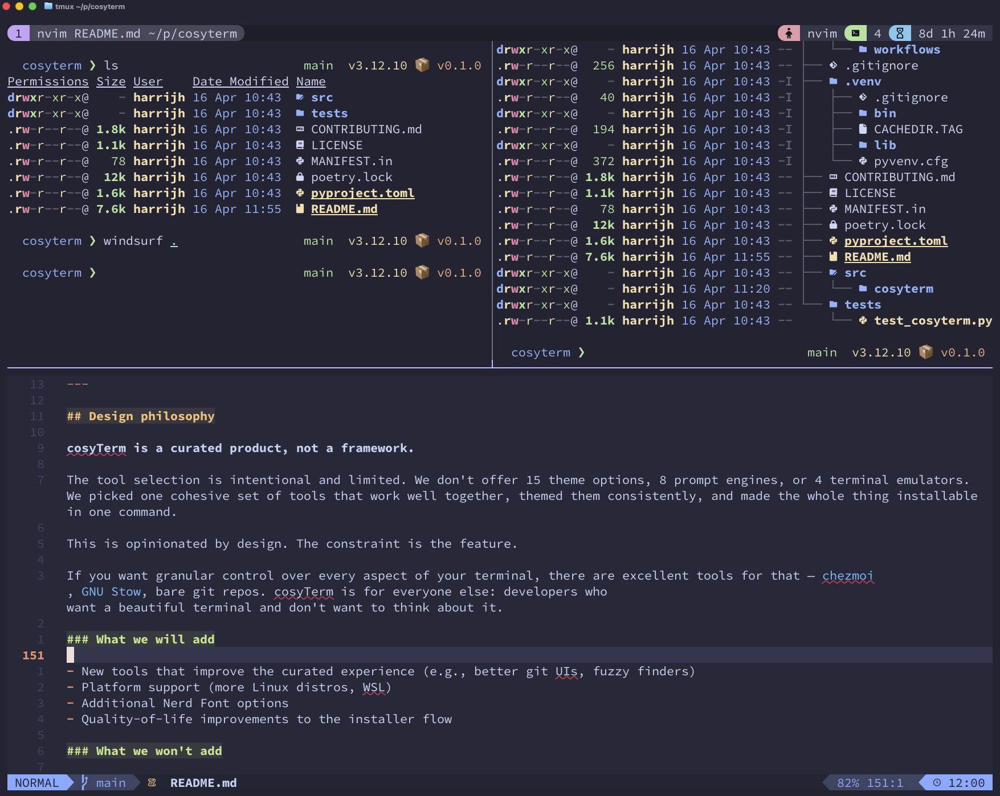

<p align="center">
  
</p>

<h1 align="center">cosyTerm</h1>

<p align="center">
  <strong>Your terminal, but make it cozy.</strong>
</p>

<p align="center">
  <a href="https://pypi.org/project/cosyterm/"></a>
  <a href="https://github.com/JoshuaHarris391/cosyterm/actions"></a>
  <a href="LICENSE"></a>
  <a href="#"></a>
</p>

<p align="center">
  <sub>You want a beautiful terminal. You don't want to spend a weekend configuring one.<br/><b>cosyTerm</b> gives you the whole thing in one command.</sub>
</p>

<p align="center">
  
</p>

---

## The idea

Most developers know their terminal *could* look better. Fewer want to spend hours reading dotfile repos, debugging shell configs, and cross-referencing theme ports across six different tools.

**cosyTerm** is for you if:

- You've seen those gorgeous terminal screenshots and thought *"I want that but I don't want to do all… that"*
- You'd rather run one command than hand-wire configs for a weekend
- You want everything to match — prompt, editor, multiplexer, file listings — without hunting down theme ports yourself
- You care about how your tools look and feel, but terminal customisation isn't your hobby

Two commands. Done.

```bash
pip install cosyterm
cosyterm
```

## What you get

A curated, cohesive terminal — every piece themed with **[Catppuccin Mocha](https://catppuccin.com)**.

| Tool | What it does |
|---|---|
| **[Nerd Font](https://www.nerdfonts.com/)** | Your choice of 10 patched fonts — JetBrains Mono, Commit Mono, Cascadia Code, and more |
| **[Ghostty](https://ghostty.org)** | GPU-accelerated terminal emulator by Mitchell Hashimoto |
| **[Fish](https://fishshell.com/) or [Zsh](https://www.zsh.org/)** | Fish (recommended) or Zsh (POSIX-compatible) |
| **[Starship](https://starship.rs)** | Cross-shell prompt — git, language versions, right-aligned and clean |
| **[eza](https://eza.rocks)** | `ls` with icons, colors, git status, and tree views |
| **[tmux](https://github.com/tmux/tmux)** | Terminal multiplexer with pastel status bar at top |
| **[NeoVim](https://neovim.io) + [LazyVim](https://lazyvim.github.io)** | IDE-grade editor, pre-configured, zero setup |

## How it works

```bash
cosyterm
```

An interactive installer walks you through 7 steps. Every step asks before doing anything. Skip what you don't want. Nothing is installed silently.

```
╔═══════════════════════════════════════════════════════════════╗
║           cosyTerm — your terminal, but make it cozy         ║
╚═══════════════════════════════════════════════════════════════╝

Step 1/7 ▶ Pick a font
Step 2/7 ▶ Ghostty terminal
Step 3/7 ▶ Shell (Zsh default)
Step 4/7 ▶ Starship prompt
Step 5/7 ▶ eza (better ls)
Step 6/7 ▶ tmux + Catppuccin
Step 7/7 ▶ NeoVim + LazyVim
```

When it's done, close your terminal, open Ghostty, and everything just works.

## Something feel off?

```bash
cosyterm doctor
```

```
━━━ cosyTerm doctor ━━━

  ✓ Ghostty          /opt/homebrew/bin/ghostty
  ✓ Starship         /opt/homebrew/bin/starship
  ✓ Starship config  ~/.config/starship.toml
  ✓ eza              /opt/homebrew/bin/eza
  ✓ tmux             /opt/homebrew/bin/tmux
  ✓ Catppuccin tmux  ~/.config/tmux/plugins/catppuccin/tmux
  ✓ NeoVim           /opt/homebrew/bin/nvim
  ✓ LazyVim config   ~/.config/nvim

  ✓ No config/binary mismatches found
```

Checks for missing binaries, orphaned configs, PATH issues, and font problems.

## Safety

cosyTerm modifies files in your home directory and, on Linux, runs `sudo` for package installs and for appending Fish to `/etc/shells`. Here's how it minimises blast radius.

- **Backups** — existing configs are backed up to `~/.terminal-setup-backups/<timestamp>/` before being touched. The NeoVim step **moves** (not copies) `~/.config/nvim`, `~/.local/share/nvim`, and `~/.local/state/nvim` into the backup so plugin state and your `lazy-lock.json` come back exactly if you restore. Cache (`~/.cache/nvim`) is regenerable and not backed up.
- **Manifest** — every move/copy is recorded in `<backup>/manifest.tsv` so `cosyterm restore` can undo them exactly.
- **Confirmations** — every install and config write asks `[y/N]` first. Replacing an existing NeoVim config requires typing `replace` — not a single keystroke.
- **NeoVim pre-flight** — if you already have a NeoVim config, you're offered `skip` / `side-by-side` (installs to `~/.config/nvim-cosy`, original untouched) / `replace`. The safe route is the default when auto-confirming.
- **Verification** — after each install, the binary is confirmed on PATH before writing any config that references it.
- **Mismatch detection** — a final check catches configs pointing to tools that aren't installed.
- **PATH migration (best-effort)** — when switching to Fish, `export PATH=` lines in your Zsh/Bash config are translated to `fish_add_path`. Conditional logic, `eval "$(...)"` blocks, and non-PATH exports are not migrated — review `~/.config/fish/config.fish` after install.
- **Full log** — everything is recorded in `~/terminal-setup.log`.

## Recovering

Every cosyTerm run writes a manifest of what it changed, so you can reverse it with one command.

```bash
# See what's available
cosyterm restore --list

# Preview what a restore would do — changes nothing on disk
cosyterm restore --latest --dry-run

# Reverse the most recent install completely
cosyterm restore --latest

# Reverse just one step (e.g. bring your NeoVim config back)
cosyterm restore --latest --only neovim

# Restore from a specific backup by timestamp
cosyterm restore --from 20250415_143022

# Verify a backup's integrity without restoring
cosyterm restore --verify --latest
```

Under the hood: `restore` reads `manifest.tsv` from the chosen backup dir, moves your current post-install state into a `pre-restore-<timestamp>/` subdir (so a restore is itself reversible), then moves every backed-up path back where it came from.

If the CLI isn't handy, the backups are plain directories — you can also `ls ~/.terminal-setup-backups/` and copy files back manually:

```bash
ls ~/.terminal-setup-backups/
cp ~/.terminal-setup-backups/20250415_143022/.zshrc ~/.zshrc
```

## Python API

```python
import cosyterm

cosyterm.setup()        # run the interactive installer
cosyterm.doctor()       # check for issues
```

## Requirements

macOS or Linux · Python 3.8+ · bash · git · Homebrew (macOS) or apt/dnf/pacman (Linux)

---

## Design philosophy

**cosyTerm is a curated product, not a framework.**

The tool selection is intentional and limited. I don't offer 15 theme options, 8 prompt engines, or 4 terminal emulators. I picked one cohesive set of tools that work well together, themed them consistently, and made the whole thing installable in one command.

This is opinionated by design. The constraint is the feature.


### What I will add

- New tools that improve the curated experience (e.g., better git UIs, fuzzy finders)
- Platform support (more Linux distros, WSL)
- Additional Nerd Font options
- Quality-of-life improvements to the installer flow

### What I won't add

- Multiple competing themes or colour schemes
- Alternative tools that do the same thing as an existing pick
- Options that require the user to understand terminal internals
- Anything that makes the "just run it" experience more complicated

## Contributing

Open source contributions are welcome. Whether it's bug fixes, installer improvements, new platform support, or better defaults — I'd love the help.

Before adding a new tool or feature, open an issue to discuss it. I want to keep the curated feel, so not everything will be a fit, but the conversation is always welcome.

See [CONTRIBUTING.md](CONTRIBUTING.md) for guidelines.

## Credits

- Setup guide by **[Guillaume Moigneu](https://devcenter.upsun.com/posts/my-terminal-setup-mac-linux/)** at Upsun
- Theme: **[Catppuccin](https://catppuccin.com)** by the Catppuccin community
- Prompt: **[Starship](https://starship.rs)**
- Terminal: **[Ghostty](https://ghostty.org)** by Mitchell Hashimoto
- Editor: **[NeoVim](https://neovim.io)** + **[LazyVim](https://lazyvim.github.io)**

## License

[MIT](LICENSE)
